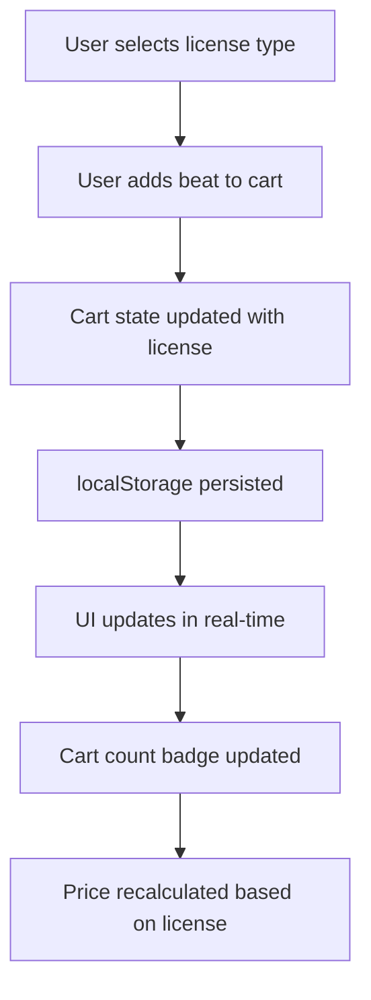
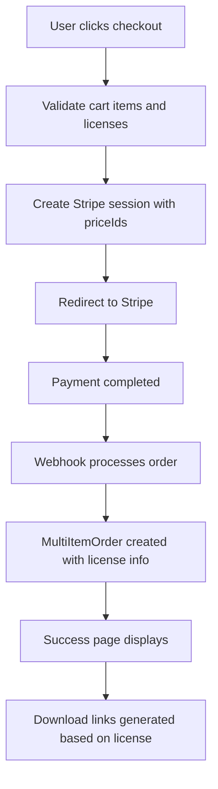
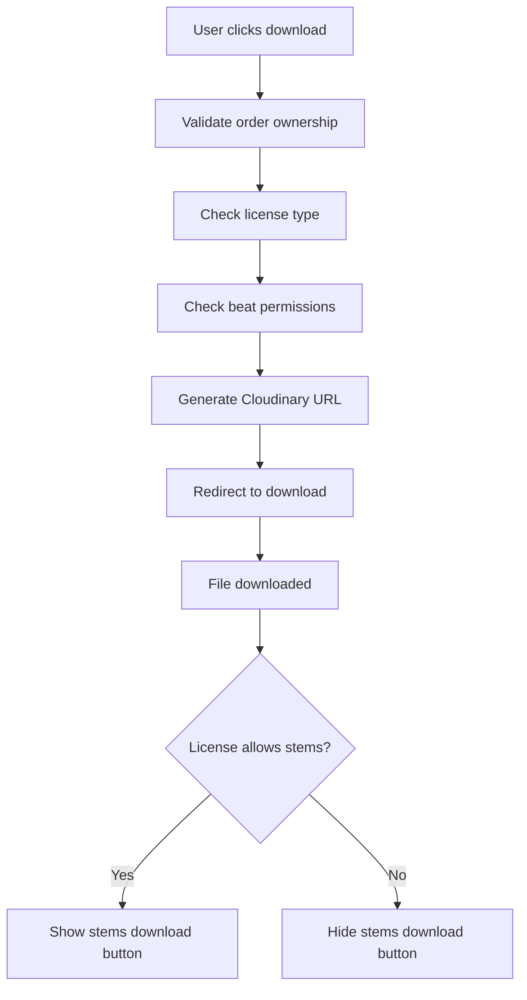

# 🛒 Multi-Item Cart & Order System Documentation

## Overview

This document describes the complete multi-item cart and order system implemented for the Woodpecker beats platform. The system allows users to add multiple beats to their cart with different license types, checkout in a single transaction, and receive individual download links for each purchased beat based on their selected license.

## 🏗️ Architecture

### Database Schema

#### MultiItemOrder Model
```prisma
model MultiItemOrder {
  id          String   @id @default(cuid())
  
  // Customer information
  customerEmail String
  customerName  String?
  customerPhone String?
  
  // Order details
  totalAmount   Decimal  @db.Decimal(10, 2)
  currency      String   @default("EUR")
  status        OrderStatus @default(PENDING)
  
  // Payment information
  paymentMethod String?
  paymentId     String?  // External payment provider ID
  paidAt        DateTime?
  sessionId     String?  // Stripe session ID for multi-item orders
  
  // License information
  licenseType   LicenseType @default(WAV_LEASE)
  usageRights  String[]    // Array of usage rights
  
  // Timestamps
  createdAt    DateTime @default(now())
  updatedAt    DateTime @updatedAt
  
  // Relations
  items        OrderItem[]
  userId       String?  // Optional user relation
  user         User?    @relation(fields: [userId], references: [id], onDelete: SetNull)
  
  // Indexes
  @@index([customerEmail])
  @@index([status])
  @@index([createdAt])
  @@index([sessionId])
  @@index([userId])
}
```

#### OrderItem Model
```prisma
model OrderItem {
  id          String   @id @default(cuid())
  
  // Item details
  quantity    Int
  unitPrice   Decimal  @db.Decimal(10, 2)
  totalPrice  Decimal  @db.Decimal(10, 2)
  
  // Timestamps
  createdAt   DateTime @default(now())
  updatedAt   DateTime @updatedAt
  
  // Relations
  orderId     String
  order       MultiItemOrder @relation(fields: [orderId], references: [id], onDelete: Cascade)
  beatId      String
  beat        Beat     @relation(fields: [beatId], references: [id], onDelete: Cascade)
  
  // Indexes
  @@index([orderId])
  @@index([beatId])
}
```

## 🎯 Core Components

### 1. Cart Context & State Management

**File**: `src/contexts/CartContext.tsx`

The cart system uses React Context with useReducer for state management:

```typescript
interface CartState {
  items: CartItem[]
  totalItems: number
  totalPrice: number
  isOpen: boolean
}

interface CartItem {
  beat: Beat
  licenseType: LicenseType
  quantity: number
  addedAt: Date
}
```

**Key Features**:
- localStorage persistence
- Real-time cart updates
- Automatic total calculations
- Optimistic updates
- License-based pricing
- Dynamic price calculations

### 2. Custom Hooks

**File**: `src/hooks/useCart.ts`

Provides convenient hooks for cart operations:

```typescript
// Main cart hook
const { cart, addToCart, removeFromCart, updateQuantity, clearCart } = useCart()

// Specialized hooks
const cartCount = useCartCount()
const cartTotal = useCartTotal()
const cartItems = useCartItems()

// License utilities
const getPriceByLicense = (beat: Beat, licenseType: LicenseType) => {
  switch (licenseType) {
    case 'WAV_LEASE': return beat.wavLeasePrice
    case 'TRACKOUT_LEASE': return beat.trackoutLeasePrice
    case 'UNLIMITED_LEASE': return beat.unlimitedLeasePrice
    default: return beat.wavLeasePrice
  }
}
```

### 3. UI Components

#### CartItem Component
**File**: `src/components/CartItem.tsx`

Displays individual cart items with:
- Beat details (title, genre, BPM, key, duration)
- License type display and selection
- Quantity controls (+/- buttons)
- Remove functionality
- Dynamic price calculations based on license
- Smooth animations

#### CartSummary Component
**File**: `src/components/CartSummary.tsx`

Shows order summary with:
- Itemized breakdown with license types
- Dynamic total calculations based on licenses
- Checkout button
- Clear cart option
- Empty state handling
- License type indicators

#### AddToCartButton Component
**File**: `src/components/AddToCartButton.tsx`

Reusable button for adding beats to cart:
- Multiple sizes (sm, md, lg)
- Different variants (default, outline, ghost)
- Loading states
- Success feedback
- Smooth animations
- License type selection
- Dynamic pricing display

## 🔄 Order Flow

### 1. Cart Management



### 2. Checkout Process



### 3. Download Flow



## 🛠️ API Endpoints

### Cart & Checkout APIs

#### Multi-Item Checkout
**Endpoint**: `POST /api/stripe/create-multi-checkout`

**Request Body**:
```typescript
{
  items: Array<{
    priceId: string
    quantity: number
    beatTitle: string
    licenseType: LicenseType
  }>
  successUrl: string
  cancelUrl: string
}
```

**Response**:
```typescript
{
  url: string
  sessionId: string
}
```

### Order Management APIs

#### Get Multi-Item Order
**Endpoint**: `GET /api/orders/multi-payment/[sessionId]`

**Response**:
```typescript
{
  success: boolean
  data: MultiItemOrder
}
```

### Download APIs

#### Generate Multi-Order Downloads
**Endpoint**: `POST /api/download/multi-order/[orderId]`

**Request Body**:
```typescript
{
  customerEmail: string
}
```

**Response**:
```typescript
{
  success: boolean
  data: {
    orderId: string
    customerEmail: string
    beats: Array<{
      beatId: string
      beatTitle: string
      downloadUrls: {
        master: string
        expiresAt: string
      }
      hasStems: boolean
    }>
    expiresAt: string
  }
}
```

#### Download Individual Beat
**Endpoint**: `GET /api/download/beat/[beatId]`

**Query Parameters**:
- `orderId`: Order ID
- `customerEmail`: Customer email
- `type`: 'master' | 'preview'

## 🔧 Stripe Integration

### Webhook Processing

**File**: `src/app/api/stripe/webhook/route.ts`

The webhook automatically detects single vs multi-item orders:

```typescript
// Detect order type
const lineItems = fullSession.line_items.data
const isMultiItem = lineItems.length > 1

if (isMultiItem) {
  // Create MultiItemOrder with OrderItem records
  const multiOrder = await prisma.multiItemOrder.create({
    data: {
      // ... order details
      items: {
        create: orderItems.map(item => ({
          beatId: item.beatId,
          quantity: item.quantity,
          unitPrice: item.unitPrice,
          totalPrice: item.totalPrice
        }))
      }
    }
  })
} else {
  // Create single Order (existing logic)
  const order = await OrderService.createOrder(orderData)
}
```

## 📱 User Interface

### Success Page

**File**: `src/app/success/page.tsx`

The success page automatically detects order type and displays appropriate interface:

#### Multi-Item Order Display
- Order details with total amount
- Individual beat cards with metadata
- Separate download sections for each beat
- Responsive design with animations

#### Single-Item Order Display
- Traditional single beat display
- Direct download links
- Order confirmation details

### Cart Page

**File**: `src/app/cart/page.tsx`

Features:
- Empty cart state with call-to-action
- Cart items with full functionality
- Order summary with totals
- Checkout integration
- Loading states and error handling

## 🔒 Security Features

### Download Security
- Order ownership validation
- Email verification
- 30-minute URL expiration
- Secure Cloudinary signed URLs

### Data Validation
- Input sanitization
- Type checking
- Error handling
- Graceful fallbacks

## 📊 Performance Optimizations

### State Management
- Optimistic updates
- Debounced operations
- Memoized calculations
- Efficient re-renders

### Database Queries
- Proper indexing
- Optimized joins
- Connection pooling
- Query caching

### UI Performance
- Lazy loading
- Image optimization
- Smooth animations
- Responsive design

## 🧪 Testing

### Test Page
**File**: `src/app/cart-test/page.tsx`

Complete testing interface with:
- Mock beat data
- Real-time cart state display
- All functionality demonstration
- Error testing capabilities

### Manual Testing Checklist

- [ ] Add single beat to cart with different licenses
- [ ] Add multiple beats to cart with mixed licenses
- [ ] Update quantities
- [ ] Remove items from cart
- [ ] Clear entire cart
- [ ] Test license selection modal
- [ ] Proceed to checkout
- [ ] Complete payment
- [ ] View success page
- [ ] Generate download links
- [ ] Download individual beats
- [ ] Test stems download (Trackout/Unlimited only)
- [ ] Test mobile responsiveness

## 🚀 Deployment Considerations

### Environment Variables
```env
NEXT_PUBLIC_BASE_URL=https://yourdomain.com
STRIPE_SECRET_KEY=sk_...
STRIPE_WEBHOOK_SECRET=whsec_...
DATABASE_URL=postgresql://...
```

### Database Migration
```bash
npx prisma migrate deploy
npx prisma generate
```

### Production Checklist
- [ ] Update base URLs
- [ ] Configure Stripe webhooks
- [ ] Set up database indexes
- [ ] Test payment flows
- [ ] Verify download security
- [ ] Monitor error logs

## 🔄 Maintenance

### Regular Tasks
- Monitor cart abandonment rates
- Check download link expiration
- Review error logs
- Update dependencies
- Test payment flows

### Monitoring
- Cart conversion rates
- Download success rates
- Payment completion rates
- Error frequency
- Performance metrics

## 📈 Future Enhancements

### Potential Features
- Wishlist functionality
- Saved carts
- Bulk discount pricing
- Order history
- Download history
- Email notifications
- Order tracking
- Refund management

### Technical Improvements
- Redis caching
- CDN integration
- Advanced analytics
- A/B testing
- Performance monitoring
- Error tracking

## 🆘 Troubleshooting

### Common Issues

#### Cart Not Persisting
- Check localStorage availability
- Verify cart context provider
- Check for JavaScript errors

#### Download Links Not Working
- Verify order ownership
- Check URL expiration
- Validate Cloudinary configuration

#### Payment Issues
- Check Stripe configuration
- Verify webhook endpoints
- Review error logs

#### Database Errors
- Ensure Prisma client is generated
- Check database connection
- Verify schema migrations

### Debug Tools
- Browser developer tools
- Network tab monitoring
- Console error checking
- Database query logging
- Stripe webhook logs

## 📞 Support

For technical support or questions about the cart system:

1. Check this documentation
2. Review error logs
3. Test with cart-test page
4. Verify environment configuration
5. Contact development team

---

**Last Updated**: January 2025
**Version**: 2.0.0
**Maintainer**: Development Team
